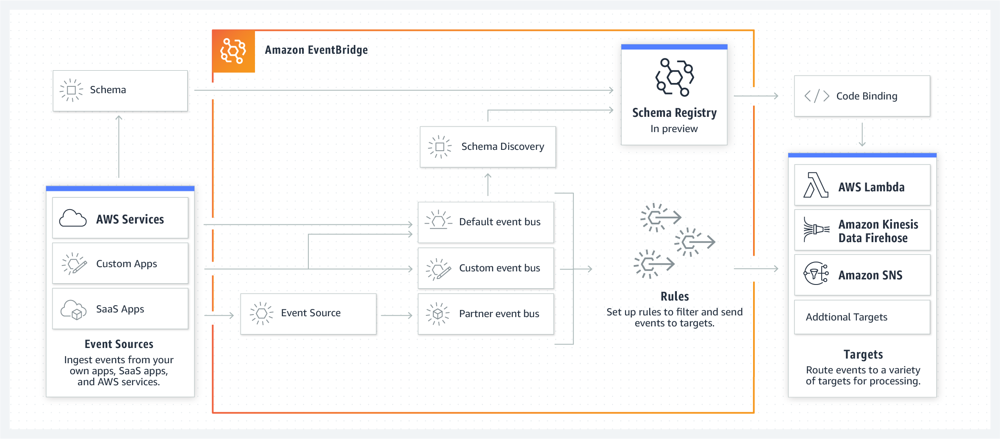

EventBridge 以前的名称为 Amazon CloudWatch Events。

## 官方介绍

信息来自官方网站： https://aws.amazon.com/cn/eventbridge/

### EventBridge介绍

官方对 Amazon EventBridge 的介绍概括为：

> Serverless event bus that connects application data from your own apps, SaaS, and AWS services
> 
> 无服务器事件总线，用于连接来自您自己的应用程序、SaaS 和 AWS 服务的应用程序数据

EventBridge 的详细介绍为：

> Amazon EventBridge is a serverless event bus that makes it easy to connect applications together using data from your own applications, integrated Software-as-a-Service (SaaS) applications, and AWS services. EventBridge delivers a stream of real-time data from event sources, such as Zendesk, Datadog, or Pagerduty, and routes that data to targets like AWS Lambda. You can set up routing rules to determine where to send your data to build application architectures that react in real time to all of your data sources. EventBridge makes it easy to build event-driven applications because it takes care of event ingestion and delivery, security, authorization, and error handling for you.
> 
> Amazon EventBridge 是一种无服务器事件总线，支持您使用自己的应用程序、集成软件即服务 (SaaS) 应用程序和 AWS 服务的数据轻松将应用程序连接到一起。EventBridge 提供来自事件源（例如 Zendesk、Datadog 或 Pagerduty）的实时数据流，并将该数据路由到 AWS Lambda 之类的目标。您可以设置路由规则来确定发送数据的目的地，以便构建能够实时响应所有数据源的应用程序架构。EventBridge 让事件驱动型应用程序的构建变得简单，因为它可以为您完成事件摄取和传送、安全保障、授权以及错误处理工作。

Schema Registry 是 Amazon EventBridge 下的一个组件：

> Schema Registry - Now in Preview: As your applications become more interconnected through events, you need to spend more effort in finding events and understanding their structure in order to write code to react to those events. The Amazon EventBridge schema registry stores event structure - or schema - in a shared central location and maps those schemas to code for Java, Python, and Typescript so it’s easy to use events as objects in your code. Schema from your event bus can be automatically added to the registry through the schema discovery feature. You can connect to and interact with the schema registry from the AWS Management Console, APIs, or the SDK Toolkits for Jetbrains (Intellij, PyCharm, Webstorm, Rider) and VS Code.
> 
> Schema Registry - 目前为预览版：由于应用程序中的事件之间的联系日益紧密，您需要花费更多的精力来查找事件并了解其结构，才能编写出代码来响应这些事件。Amazon EventBridge Schema 注册表可将事件结构（即 Schema）存储在共享的中央位置，并将这些 Schema 映射至 Java、Python 和 Typescript 代码，从而让您能够在代码中以对象形式轻松使用事件。事件总线的 Schema 可通过 Schema 发现功能自动添加至注册表中。您可以从 AWS 管理控制台、API 或者适用于 Jetbrains（Intellij、PyCharm、Webstorm、Rider）和 VS 代码的软件开发工具包连接至 Schema 注册表并与之交互。

### EventBridge的优点

- 连接来自 SaaS 应用程序的数据

	EventBridge 从受支持的 SaaS 应用程序中摄取数据，并通过 AWS 管理控制台中的原生集成将数据路由到 AWS 服务目标。借助 EventBridge，您可以使用来自 SaaS 应用程序的数据来触发针对客户支持、业务运营等等的工作流程。

- 编写更少代码

	借助 EventBridge，您可以轻松地将应用程序连接在一起，因为您可以在不编写自定义代码的情况下摄取、筛选和传送事件。EventBridge 可自动将来自源的事件路由到一个或多个受支持的 AWS 服务目标，比如 AWS Lambda 和 Amazon Kinesis Data Streams。

- 轻松构建事件驱动型架构

	EventBridge 简化了构建事件驱动型架构的流程。借助 EventBridge，您的事件目标不需要知道事件源，因为您可以直接进行筛选并发布到 EventBridge。无需任何设置。事件驱动型架构是松散耦合和分布式的，可以提高开发人员敏捷性以及应用程序弹性。

- 减少运营开销

	使用 EventBridge 后，无需预配置、修补和管理服务器，也不需要安装、维护或操作软件。EventBridge 会根据摄取的事件数量进行自动扩展，您只需为由 AWS 或 SaaS 应用程序发布的事件付费。EventBridge 具有内置的分布式可用性和容错能力。

### EventBridge的工作原理

EventBridge 通过事件连接应用程序。事件是系统状态发生变更的信号，例如客户支持 TT 的状态发生变更。要编写代码来响应事件，您需要了解事件的 Schema，包括各种事件数据的标题、格式和验证规则等信息。EventBridge Schema Registry（预览版）可存储您的组织的应用程序、AWS 服务或 SaaS 应用程序所生成的 Schema 集以方便查找。您还可以下载 IDE 注册表中任何 Schema 的代码绑定，从而在代码中以强类型对象形式来表示事件。

### EventBridge的使用案例

- 客户支持

	您可以将客户支持 TT 中的状态变更发送到 EventBridge，触发自动化的工作流程，或使用机器学习来训练和部署情绪分析模型。例如，您可以使用 Amazon Sagemaker 在原始的 **Zendesk** TT 上附加客户满意度得分。

- 安全操作

	您可以将安全事件发送到 EventBridge，以便跨多个渠道与相关用户组通信。例如，您可以在 **Whispir** 通信工作流程中包含威胁检测事件，或使用基于事件的规则来自动交付安全系统报告。

- 业务运营

	您可以使用 EventBridge 来访问、处理运营数据并将其从一个系统发送到另一个系统。例如，您可以使用 EventBridge 将 **PagerDuty** 事件连接到 Amazon Redshift 数据仓库，让您可以分析补救速度和工程团队的平均运营负担。

- 应用程序监控

	通过使用 EventBridge 来收集实时的应用程序指标流，您可以快速响应应用程序性能的变化。例如，您可以将来自 **DataDog** 的负载量警报发送到 EventBridge，触发 AWS Lambda 函数，用以扩展您的 EC2 实例来处理预期的负载增加。

- 目录注册

	通过将用户信息发送到 EventBridge 来触发工作流程，您可以实现目录注册流程的自动化。例如，您可以将来自 **OneLogin** 的新用户创建事件发送到 EventBridge，并将其路由到 Lambda 函数，该函数可使新雇用的工程师能够使用技术资源。

- 客户数据更新

	您可以使用客户关系管理 (CRM) 系统中客户数据的更改，来触发其他系统中的工作流程。例如，当 **SugarCRM** 机会的状态变为 Closed Won（谈成结束）时，您可以将事件发送到 EventBridge，并触发将在会计系统中预配置账单记录的工作流程。

## 其他资料

### 功能列表

https://aws.amazon.com/cn/eventbridge/features/

具体有：

- Schema 注册表（预览版）

	EventBridge Schema 注册表会将事件 Schema 存储在注册表中，以方便组织中的其他开发人员搜索和访问，而无需手动查找事件及其结构。该注册表还允许您在 IDE 中直接生成 Java、Python 或 Typescript 等编程语言的代码绑定，从而在代码中以对象形式使用这些事件。启用事件总线的 Schema 发现功能之后，系统将会自动发现 Schema 事件并将其添加至注册表中，而无需手动创建事件 Schema。所有 AWS 服务 Schema 会自动显示在您的 Schema 注册表中，而当您启用 SaaS 合作伙伴事件总线的 Schema 发现功能后，将会看到集成 SaaS 应用程序的 Schema。

- 完全托管且可扩展的事件总线

	Amazon EventBridge 是一种完全托管且可扩展的无服务器事件总线，它允许应用程序使用事件进行通信。因此无需管理基础设施，也无需预配置容量。

- SaaS 集成

	您的 AWS 应用程序可根据 SaaS 应用程序生成的事件执行相应操作。Amazon EventBridge 与许多提供商的软件即服务 (SaaS) 应用程序（包括 DataDog、OneLogin、PagerDuty、Savyint、Segment、SignalFX、SugarCRM、Symantec、Whispir 和 Zendesk）原生集成，此外还有其他已在计划中的集成。您不需要管理任何集成设置，例如身份验证或 Webhook；来自 SaaS 提供商的事件只会出现在事件总线上。

- 超过 100 个内置的事件源和目标

	Amazon EventBridge 与超过 90 个事件源以及超过 15 个目标直接集成，其中包括 [AWS Lambda](https://aws.amazon.com/cn/lambda/)、[Amazon SQS](https://aws.amazon.com/cn/sqs/)、[Amazon SNS](https://aws.amazon.com/cn/sns/)、[AWS Step Functions](https://aws.amazon.com/cn/step-functions/)、[Amazon Kinesis Data Streams](https://aws.amazon.com/cn/kinesis/data-streams/)、[Amazon Kinesis Data Firehose](https://aws.amazon.com/cn/kinesis/data-firehose/) 等等，此外还有其他已在计划中的来源和目标。所有 AWS 服务中的所有更改类 API 调用（即，除 Describe*、List* 和 Get* 之外的所有调用）都通过 AWS CloudTrail 生成事件。

- 从您自己的应用程序发送事件

	您可以将 Amazon EventBridge 用作适用于企业应用程序和微服务的集中式事件总线。您可以通过该服务的 PutEvents API 将事件从您自己的应用程序发送到事件总线。随后，其他应用程序可以通过任意受支持的 AWS 目标服务来接收事件。

- 分离的事件源和目标

	Amazon EventBridge 使您能够轻松地构建 [事件驱动型应用程序架构](https://aws.amazon.com/cn/event-driven-architecture/)。应用程序或微服务可以在不知道订阅者的情况下将事件发布到事件总线。应用程序或微服务可以在不知道发布者的情况下订阅事件。这种分离使团队能够独立工作，从而能加快开发速度并提高敏捷性。

- 事件筛选

	您可以使用规则来筛选事件。规则会针对给定的事件总线匹配传入的事件，然后将其路由到目标进行处理。一项规则可以将事件路由到多个目标进行并行处理。规则可以让不同的应用程序组件查找和处理自己想要处理的事件。规则可以对事件进行自定义（例如只传输特定部分或者使用常量覆盖事件），然后再将其发送到目标。您也可以有多个规则匹配同一个事件，因此，不同的微服务或应用程序可以根据特定的筛选条件来选择匹配事件。

- 可靠的事件传送

	Amazon EventBridge 会至少向目标传送事件一次，包括使用指数退避算法重试最多 24 小时。事件可以跨多个可用区 (AZ) 持久存储，从而能进一步保证将事件传送到其目的地。Amazon EventBridge 还提供 99.9% 的可用性服务等级协议 (SLA)，从而确保您的应用程序能够可靠地访问服务。

- 自动响应 AWS 服务中的操作更改

	Amazon EventBridge 扩展了它的前身（也就是 Amazon CloudWatch Events），并提供近乎实时的系统事件流，这些事件描述了 AWS 资源的更改。它让您能够快速响应操作更改并采取纠正措施。您只需编写规则以指明哪些事件与您的应用程序有关，以及当规则与事件匹配时要执行哪些自动化操作。例如，您可以设置一条规则来调用 AWS Lambda 函数，修复问题，或发布一条 Amazon Simple Notification Service (SNS) 主题通知来提醒操作员。

- 计划事件

	您可以使用常见的 Unix cron 语法来设置计划事件。计划事件定期生成，并且会调用任何受支持的目标 AWS 服务。

- 监控和审计

	您可以使用 Amazon CloudWatch 指标（例如某个事件匹配规则的次数，或者调用目标的次数）监控事件总线。您可以使用 Amazon CloudWatch Logs 存储、监控和分析在您的环境中触发的事件。AWS CloudTrail 使您能够监控对 Amazon EventBridge API 进行的调用。

- 安全性与合规性

	Amazon EventBridge 已与 [AWS Identity and Access Management](https://aws.amazon.com/cn/iam/) (IAM) 集成，因此您可以控制哪些用户和资源有权访问您的数据及其访问方式。 EventBridge 支持 VPC 终端节点和使用 TLS 1.2 进行动态加密。Amazon EventBridge 符合 GDPR、SOC、ISO、DoD CC SRG 和 FedRamp 的规定，也符合 HIPAA 的要求。

- 按事件付费

	由 AWS 服务生成的事件均免费。您只需为由您自己的应用程序或 SaaS 应用程序生成的事件付费（请参阅此处的[定价](https://aws.amazon.com/cn/eventbridge/pricing/)）。

### 集成

https://aws.amazon.com/cn/eventbridge/integrations/

很强大的集成能力。。。